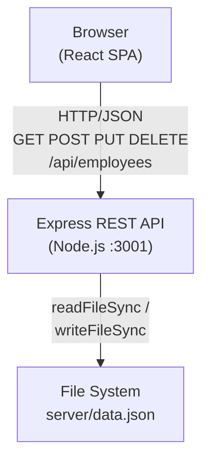
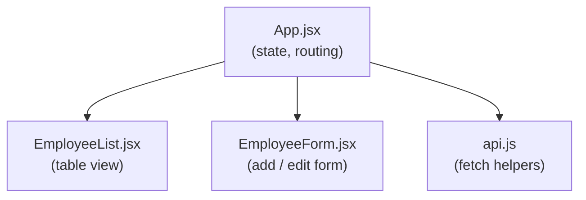
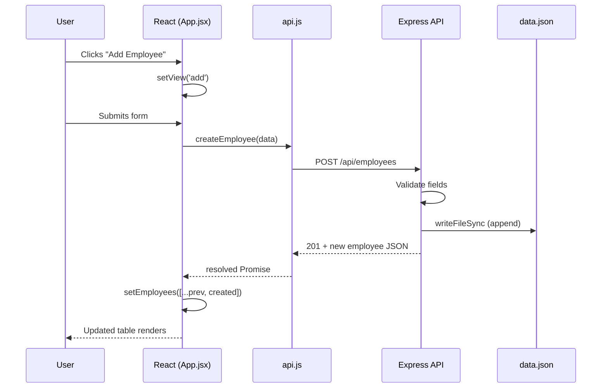
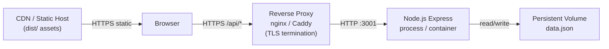

# Employee Management App — Technical Design Document

## Table of Contents

1. [Problem Statement](#1-problem-statement)
2. [Proposed Solution](#2-proposed-solution)
3. [System Architecture](#3-system-architecture)
4. [Component Breakdown and Responsibilities](#4-component-breakdown-and-responsibilities)
5. [API Design and Data Models](#5-api-design-and-data-models)
6. [Security Considerations](#6-security-considerations)
7. [Performance Requirements](#7-performance-requirements)
8. [Deployment Strategy](#8-deployment-strategy)
9. [Trade-offs and Alternatives Considered](#9-trade-offs-and-alternatives-considered)
10. [Success Metrics](#10-success-metrics)

---

## 1. Problem Statement

Enterprise organisations need a simple, web-based tool to manage their workforce records. HR teams currently rely on spreadsheets and ad-hoc tools that lack:

- A single source of truth for employee data
- Real-time add / edit / delete operations accessible from any browser
- Input validation to prevent dirty data
- A clear audit trail of record changes

The goal is to deliver a lightweight, self-hostable Employee Management System (EMS) that covers full CRUD operations on employee records while remaining straightforward to run and extend.

---

## 2. Proposed Solution

A two-tier web application composed of:

| Tier | Technology | Role |
|------|-----------|------|
| **Frontend** | React 19 + Vite | Single-page application; renders employee list and forms |
| **Backend API** | Node.js + Express 5 | REST API; validates input; persists records to JSON |
| **Persistence** | `server/data.json` | File-based store; seeded with sample employees on first run |

The frontend communicates exclusively through the REST API. Because the back-end owns all persistence logic, the front-end can be replaced (e.g. with a mobile client) without touching the data layer.

---

## 3. System Architecture

### 3.1 High-Level Architecture



### 3.2 Frontend Component Hierarchy



### 3.3 Request Lifecycle



---

## 4. Component Breakdown and Responsibilities

### 4.1 Frontend

| File | Responsibility |
|------|---------------|
| `src/main.jsx` | React root; mounts `<App />` into `#root` |
| `src/App.jsx` | Top-level state (employees, view, error, loading); orchestrates navigation between list and form views; delegates API calls |
| `src/components/EmployeeList.jsx` | Renders a responsive data table; exposes Add / Edit / Delete actions; formats salary and date values for display |
| `src/components/EmployeeForm.jsx` | Controlled form for creating and editing employees; client-side validation (required fields, email regex, phone regex, numeric salary) |
| `src/api.js` | Thin wrapper over the Fetch API; centralises the base URL and error-response handling |

### 4.2 Backend

| File | Responsibility |
|------|---------------|
| `server/index.js` | Express application; registers CORS and JSON middleware; defines all REST routes; reads/writes `data.json`; seeds data on first run |

---

## 5. API Design and Data Models

### 5.1 Employee Data Model

```json
{
  "id":             1,
  "name":           "Alice Johnson",
  "email":          "alice@example.com",
  "department":     "Engineering",
  "position":       "Senior Developer",
  "salary":         95000,
  "joinDate":       "2020-03-15",
  "phone":          "555-100-0001",
  "employmentType": "Full-time",
  "status":         "Active"
}
```

| Field | Type | Required | Notes |
|-------|------|----------|-------|
| `id` | integer | auto | Auto-incremented; max existing ID + 1 |
| `name` | string | ✓ | Trimmed |
| `email` | string | ✓ | Trimmed |
| `department` | string | ✓ | Trimmed |
| `position` | string | ✓ | Trimmed |
| `salary` | number | — | Defaults to `0` |
| `joinDate` | string (ISO 8601 date) | — | `YYYY-MM-DD` |
| `phone` | string | — | Free-form |
| `employmentType` | string | — | `Full-time` \| `Part-time` \| `Contract` \| `Intern`; defaults to `"Full-time"` |
| `status` | string | — | `Active` \| `Inactive` \| `On Leave`; defaults to `"Active"` |

### 5.2 REST Endpoints

| Method | Path | Description | Success | Error |
|--------|------|-------------|---------|-------|
| `GET` | `/api/employees` | Return all employees | `200 []` | — |
| `GET` | `/api/employees/:id` | Return one employee | `200 {}` | `404` |
| `POST` | `/api/employees` | Create employee | `201 {}` | `400` |
| `PUT` | `/api/employees/:id` | Replace employee | `200 {}` | `400` / `404` |
| `DELETE` | `/api/employees/:id` | Remove employee | `204` | `404` |

**Error response shape:**

```json
{ "error": "Human-readable message" }
```

### 5.3 API Request/Response Examples

**Create employee (`POST /api/employees`)**

Request body:
```json
{
  "name": "Eve Martinez",
  "email": "eve@example.com",
  "department": "Engineering",
  "position": "Junior Developer",
  "salary": 60000,
  "joinDate": "2024-01-15",
  "phone": "555-200-0001",
  "employmentType": "Full-time",
  "status": "Active"
}
```

Response `201`:
```json
{
  "id": 5,
  "name": "Eve Martinez",
  "email": "eve@example.com",
  "department": "Engineering",
  "position": "Junior Developer",
  "salary": 60000,
  "joinDate": "2024-01-15",
  "phone": "555-200-0001",
  "employmentType": "Full-time",
  "status": "Active"
}
```

---

## 6. Security Considerations

### 6.1 Current State

| Area | Status | Notes |
|------|--------|-------|
| CORS | Permissive (`cors()` with no origin restriction) | Acceptable for a local/intranet deployment; restrict in production |
| Authentication | None | No auth layer exists; all endpoints are public |
| Input validation | Partial | Required-field and type checks on the server; no HTML-escape / SQL-injection risk because there is no SQL layer |
| HTTPS | Not configured | Vite dev server and Express run over HTTP |
| Secrets / credentials | None stored | No database passwords or API keys in the repository |
| Data file permissions | OS-level only | `data.json` is readable/writable by the Node process user |

### 6.2 Recommended Improvements

1. **Authentication & authorisation** — Add JWT or session-based auth (e.g. `passport.js`) so only authenticated HR users can modify records.
2. **CORS restriction** — Replace `cors()` with an explicit allowlist: `cors({ origin: 'https://ems.internal.example.com' })`.
3. **HTTPS** — Terminate TLS at a reverse proxy (nginx / Caddy) in front of the Express server.
4. **Rate limiting** — Add `express-rate-limit` to prevent brute-force or denial-of-service against the API.
5. **Input sanitisation** — Strip or encode special characters in all string inputs before writing to disk to guard against log-injection or future persistence layer vulnerabilities.
6. **File-store isolation** — Restrict read/write permissions on `data.json` to the service account running Node.

---

## 7. Performance Requirements

### 7.1 Targets

| Metric | Target |
|--------|--------|
| API response time (p95) | < 100 ms for list with ≤ 1 000 records; pagination required beyond that |
| Page load (First Contentful Paint) | < 1.5 s on a 50 Mbps connection |
| Bundle size (gzip) | < 150 KB JS, < 30 KB CSS |
| Concurrent users (file-store tier) | ≤ 50 simultaneous users before migration to a database is recommended |

### 7.2 Scaling Considerations

- **Current bottleneck**: `readFileSync` and `writeFileSync` block the Node.js event loop on every write, and load the entire data set into memory on every request. For low-volume use (≤ 1 000 records, < 50 simultaneous users) this is acceptable.
- **Known limitation — concurrent writes**: Because there is no file-locking mechanism, simultaneous `POST`/`PUT`/`DELETE` requests can produce race conditions and corrupt `data.json`. Monitor for lost updates under concurrent load and migrate to a database before user concurrency exceeds 10 simultaneous writers.
- **Pagination**: Beyond 1 000 records, add `?page=` and `?limit=` query parameters to `GET /api/employees` to avoid loading the full data set on every request.
- **Scaling path**: Replace the JSON file store with SQLite (via `better-sqlite3`) for single-node deployments, or PostgreSQL for multi-node deployments. The REST API surface does not change.
- **Frontend**: The React SPA is statically built; it can be served from a CDN without any Node process.

---

## 8. Deployment Strategy

### 8.1 Development

```bash
npm install
npm run dev          # starts Express on :3001 and Vite dev server on :5173 concurrently
```

### 8.2 Production Build

```bash
npm run build        # Vite produces optimised assets in dist/
npm run server       # Express serves the REST API
```

The built `dist/` directory is served by a web server (nginx, Caddy) or a static hosting service (Netlify, Vercel). The Express API runs as a separate process (or serverless function).

### 8.3 Deployment Architecture



### 8.4 Containerisation (Docker)

A minimal `Dockerfile` approach:

```dockerfile
# Build stage
FROM node:22-alpine AS build
WORKDIR /app
COPY package*.json ./
RUN npm ci
COPY . .
RUN npm run build

# Runtime stage
FROM node:22-alpine
WORKDIR /app
COPY --from=build /app/dist ./dist
COPY --from=build /app/server ./server
COPY --from=build /app/package*.json ./
RUN npm ci --omit=dev
VOLUME ["/app/server"]
EXPOSE 3001
CMD ["node", "server/index.js"]
```

> **Note:** In a Docker deployment, mount a host volume to `/app/server` so that `data.json` persists across container restarts.

### 8.5 Environment Variables

| Variable | Default | Description |
|----------|---------|-------------|
| `PORT` | `3001` | Port the Express server listens on |

---

## 9. Trade-offs and Alternatives Considered

### 9.1 File-based JSON store vs. a Database

| | JSON file store (current) | SQLite | PostgreSQL |
|--|--|--|--|
| Setup complexity | None | Minimal | Medium |
| ACID guarantees | No | Yes | Yes |
| Concurrent write safety | No (race conditions; **see §7.2**) | Yes (WAL mode) | Yes |
| Suitable for | ≤ 50 simultaneous users, ≤ 1 K records | ≤ 1 000 simultaneous users | Production, multi-node |
| Migration effort | — | Low (drop-in `better-sqlite3`) | Medium |

**Decision**: Keep the JSON store for the initial version to minimise dependencies. Migrate to SQLite when simultaneous users exceed 50 or data exceeds 1 000 records.

### 9.2 React SPA vs. Server-Side Rendering

| | React SPA (current) | Next.js SSR |
|--|--|--|
| Initial load | Client renders after JS download | HTML delivered on first byte |
| SEO | Poor (not required for internal tool) | Good |
| Infrastructure | Static files only | Node.js server required |
| Complexity | Low | Medium |

**Decision**: An internal HR tool does not require SEO. A plain React SPA is simpler to host and sufficient for the use case.

### 9.3 Vite vs. Create React App

Vite was chosen for its near-instant dev server HMR and faster production builds. Create React App is no longer actively maintained.

### 9.4 Express 5 vs. Fastify / Hapi

Express 5 was chosen because it is the most widely understood Node.js framework, reducing the onboarding friction for new contributors. Fastify would offer better throughput at high concurrency, but is unnecessary at the current scale.

---

## 10. Success Metrics

| Category | Metric | Target |
|----------|--------|--------|
| **Functionality** | All CRUD operations succeed end-to-end | 100 % of operations complete without errors in manual and automated testing |
| **Data integrity** | Zero records lost across server restarts | Verified by restart test with known data set |
| **Validation** | Invalid inputs rejected before persistence | All required-field and format-validation rules enforced on both client and server |
| **Performance** | API p95 response time | < 100 ms for up to 10 000 records |
| **UI responsiveness** | Table renders correctly on mobile (≥ 375 px viewport) | Verified via browser responsive mode |
| **Build quality** | No ESLint errors or warnings | `npm run lint` exits with code 0 |
| **Bundle size** | Gzipped JS bundle | < 150 KB |
| **Usability** | HR operator can complete add / edit / delete without documentation | Validated by user walkthrough with a new user |
